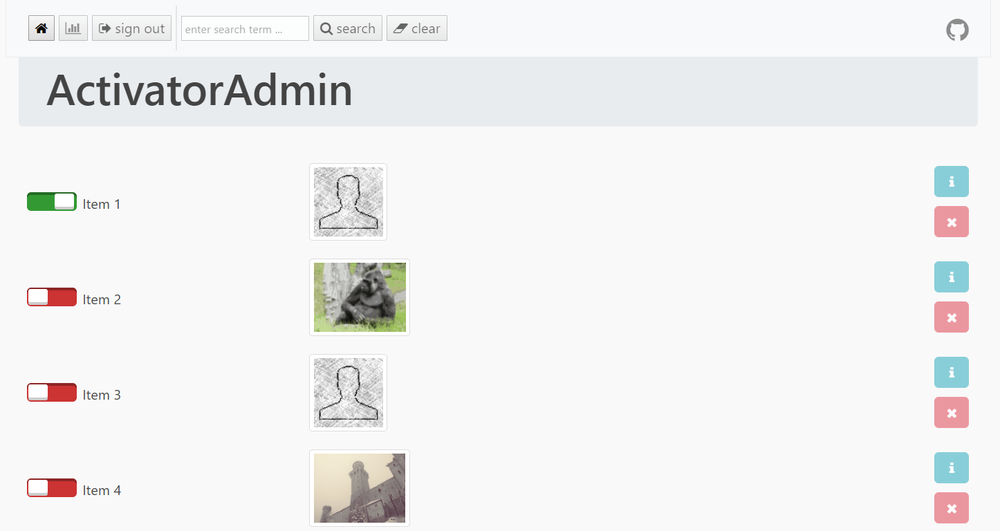

# ActivatorAdmin

[](http://travis-ci.org/dan-lyn/activatoradmin)



## Third-Party Libraries

**PHP**
- Slim Framework 3.8.1 (https://github.com/slimphp/Slim)
- Pimple 3.0.2 (https://github.com/silexphp/Pimple)
- PSR Http Message 1.0.1 (https://github.com/php-fig/http-message)
- FastRoute 1.1.0 (https://github.com/nikic/FastRoute)
- Container Interoperability 1.2.0 (https://github.com/container-interop/container-interop)
- PSR Container 1.0.0 (https://github.com/php-fig/container)
- Twig 2.4.3 (https://github.com/twigphp/Twig)
- Slim Twig View 2.2.0 (https://github.com/slimphp/Twig-View)
- Monolog 1.22.0 (https://github.com/Seldaek/monolog)
- PSR Log 1.0.2 (https://github.com/php-fig/log)

**JS**
- Backbone.js 1.3.3 (http://backbonejs.org/)
- backbone.paginator 2.0.5 (https://github.com/backbone-paginator/backbone.paginator)
- jQuery 3.2.1 (http://jquery.com/)
- RequireJS 2.3.4 (http://requirejs.org/docs/download.html)
- RequireJS text 2.0.15 (https://github.com/requirejs/text)
- D3.js 4.4.1 (https://github.com/mbostock/d3)

**CSS**
- Bootstrap 3.3.7 (http://getbootstrap.com/)
- Font Awesome 4.7.0 (http://fortawesome.github.io/Font-Awesome/)

**Grunt**
- grunt 0.4.5 (http://gruntjs.com/)
- grunt-contrib-uglify 2.1.0 (https://github.com/gruntjs/grunt-contrib-uglify)
- grunt-contrib-cssmin 2.0.0 (https://github.com/gruntjs/grunt-contrib-cssmin)
- grunt-contrib-jasmine 1.0.3 (https://github.com/gruntjs/grunt-contrib-jasmine)
- grunt-template-jasmine-requirejs 0.2.3 (https://github.com/cloudchen/grunt-template-jasmine-requirejs)
- grunt-phpunit 0.3.6 (https://github.com/SaschaGalley/grunt-phpunit)
- grunt-contrib-watch 1.0.0 (https://github.com/gruntjs/grunt-contrib-watch)
- grunt-contrib-jshint 1.1.0 (https://github.com/gruntjs/grunt-contrib-jshint)
- grunt-contrib-compass 1.1.1 (https://github.com/gruntjs/grunt-contrib-compass)
- grunt-contrib-concat 1.0.1 (https://github.com/gruntjs/grunt-contrib-concat)
- grunt-casperjs 2.2.0 (https://github.com/ronaldlokers/grunt-casperjs)
- grunt-contrib-requirejs 1.0.0 (https://github.com/gruntjs/grunt-contrib-requirejs)

**Gulp**
- gulp 3.9.1 (https://github.com/gulpjs/gulp/)
- gulp-concat 2.6.1 (https://github.com/wearefractal/gulp-concat)
- gulp-uglify 2.1.2 (https://github.com/terinjokes/gulp-uglify/)

**NodeJS**
- inquirer 3.2.1 (https://github.com/SBoudrias/Inquirer.js)
- mysql 2.14.1 (https://github.com/mysqljs/mysql)
- ini 1.3.4 (https://github.com/npm/ini)
- Chai 4.1.1 (https://github.com/chaijs/chai)

## Requirements
- PHP 7
- MySQL or MongoDB

## Usage

Login using these fixed credentials: Username = admin & Password = admin. The credentials are set in config/config.ini. To change to password you need to first generate a new one using PHP's password_hash() function. Example: "password_hash('activatoradmin_' . 'your_new_password_goes_here', PASSWORD_DEFAULT)".

A default database structure can be found in docs/db.sql. Use database mapping as explained under Configuration if the default database structure is different.

## Command-Line Usage

It is possible to (de)activate items using the command-line. Node.js is required for this. You need to know the ID of the item to activate beforehand. Enter the following command and follow instructions:
```
node cli/activatoradmin.js
```

## Configuration

Setup the configuration in config/config.ini and config/config.js. Changes to config/config.js should be followed by "grunt minify" or "gulp minifyConfig" for minifying the javascript.

It is possible to use MongoDB or MySQL as the database. This is how you set the currently active database (mongodb or mysql):
```
[db]
activedb = "mysql"
```

Mapping of column names in tables allows changing the names for "name", "isactive", and "image" to whatever matches the table in use. It must be set up in both configuration files!
```
[db_mapping]
name = "name"
isactive = "isactive"
image = "image"
```

Setting up the host and baseurl must also be specified in both configuration files (.js and .ini). Baseurl is only needed if ActivatorAdmin is not located in the root directory. Here is the format of "host" and "baseUrl" - notice that the protocol http(s) is not needed:
```
[url]
host: 'localhost'
baseUrl: '/activatoradmin/'
```

Enable/Disable logging in config/config.ini: (logging to docs/activatoradmin.log)
```
[logging]
log = 0
```

It is possible to enable and disable certain frontend features using configuration variables in config.js:
```
showInfo: true // Show info button for each item
showDelete: true // Show delete button for deleting a single item

```

## Documentation

See API Documentation generated by phpDocumentor v2.5.0 at ROOT_DIRECTORY/docs/phpdoc/

See the results from PHPLOC at ROOT_DIRECTORY/docs/phploc.csv. Update the results by running update_phploc.sh.

## Testing

Test cases have been created and tested using Jasmine v2.3.4, CasperJS v1.1.3, Mocha v3.2.0, and PHPUnit 6.1.4.

Run both Jasmine, CasperJS, and PHPUnit test cases using grunt:
```
grunt test
```

**PHPUnit**

Run PHPUnit test cases from ROOT_DIRECTORY:
```
phpunit test/phpunit
```

**CasperJS**

Run CasperJS test cases from ROOT_DIRECTORY:
```
casperjs test test/casperjs
```

**Jasmine**

Run Jasmine test cases by opening the following URL in a browser: ROOT_URL/test/jasmine/SpecRunner.html

**Mocha**

Run test of command-line version of activatoradmin using Mocha from ROOT_DIRECTORY:
```
mocha test/nodejs/test-cli-activatoradmin.js
```

## License

ActivatorAdmin is open-sourced software licensed under the [MIT license](http://opensource.org/licenses/MIT)
